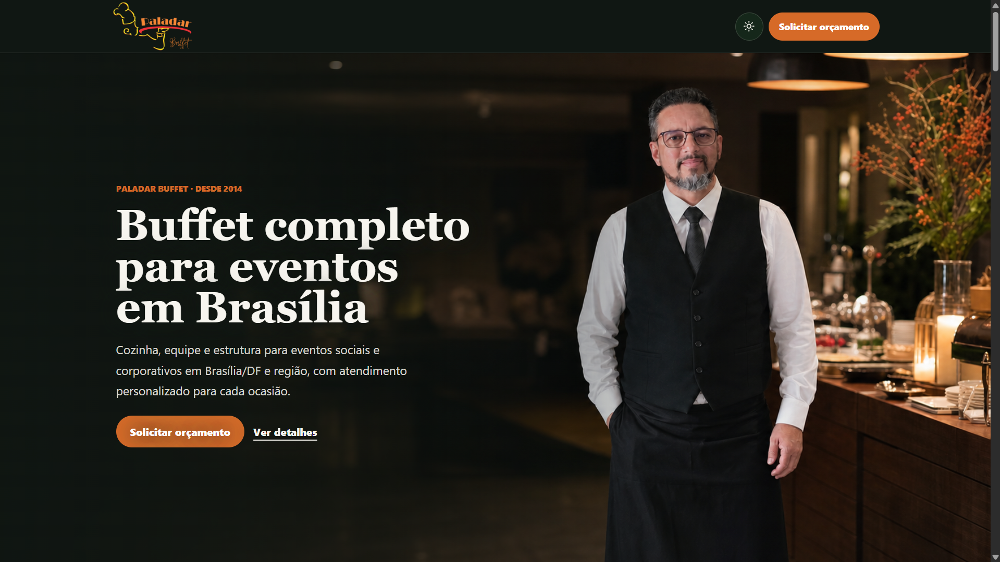
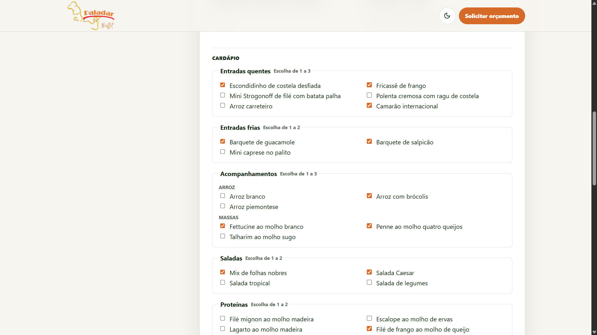
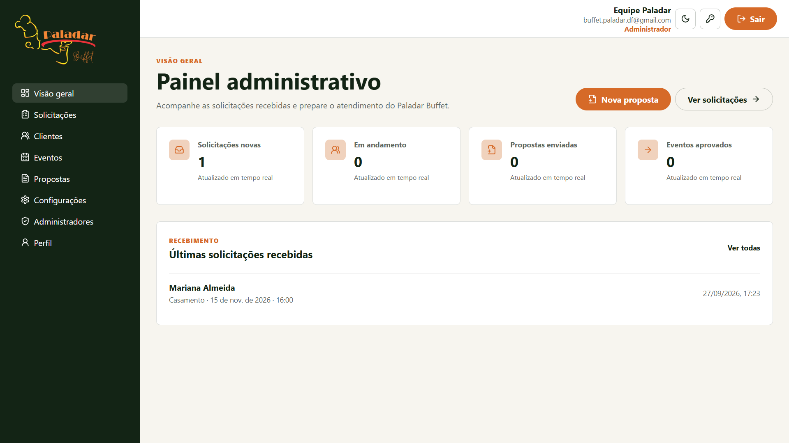
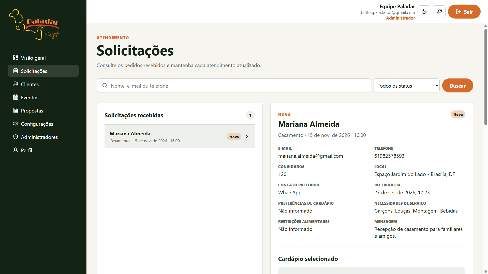
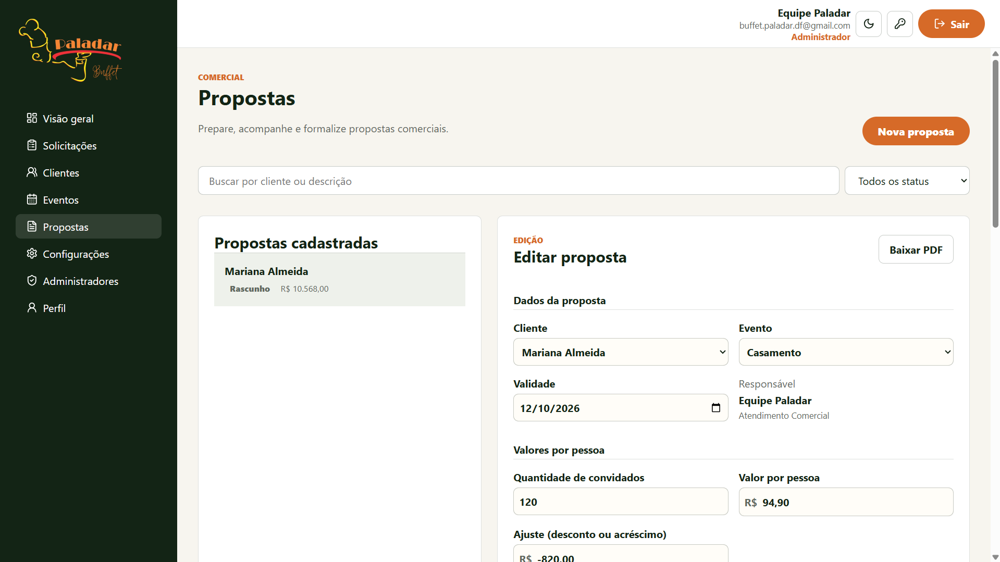
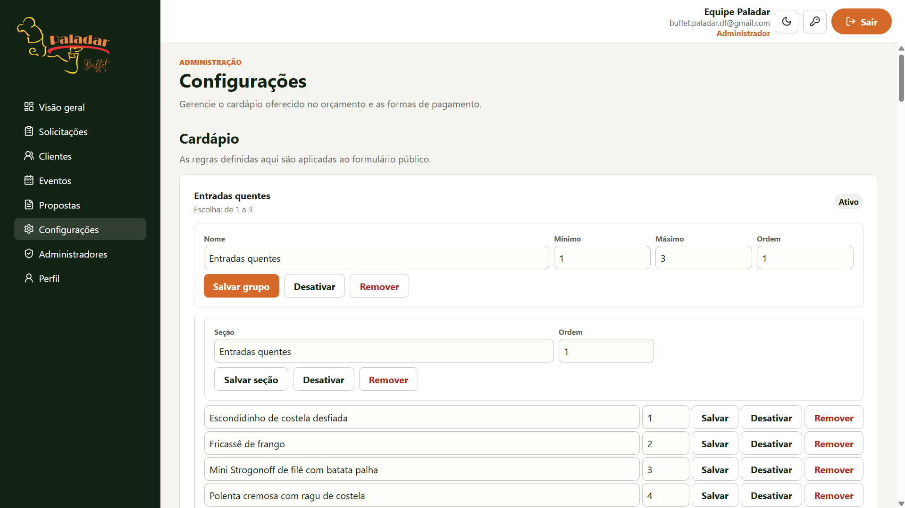
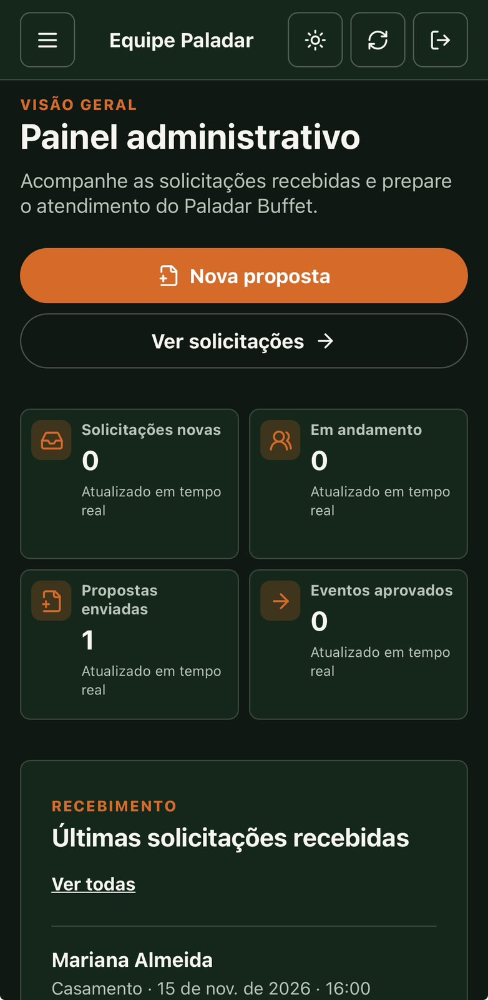
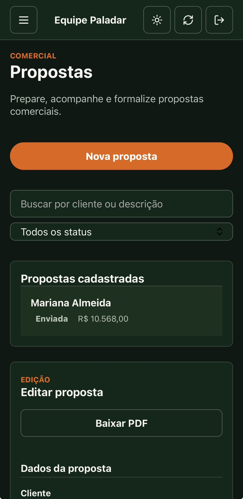
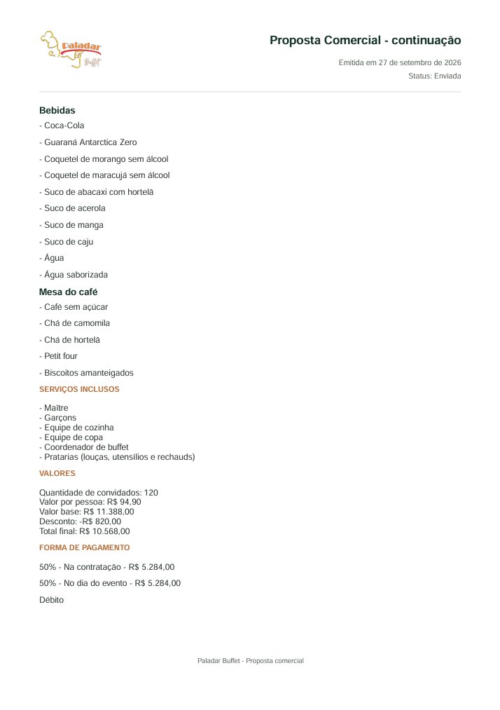

# Paladar Buffet Web

## Descrição

Aplicação web do Paladar Buffet que reúne o site institucional, a solicitação pública de orçamento com escolha de cardápio e um painel para a operação comercial do buffet. O painel acompanha solicitações, clientes, eventos, propostas e configurações em desktop e celular.

## Demonstração

### Site público

<p align="center">
  <a href="docs/screenshots/01-home-desktop-dark.png"></a>
</p>

### Orçamento e cardápio

<p align="center">
  <a href="docs/screenshots/04-quote-menu-desktop-light.png"></a>
</p>

### Gestão administrativa

<p align="center">
  <a href="docs/screenshots/05-dashboard-desktop-light.png"></a>
</p>

<p align="center">
  <a href="docs/screenshots/07-request-details-desktop-light.png"></a>
</p>

<p align="center">
  <a href="docs/screenshots/10-proposal-editor-desktop-light.png"></a>
</p>

<p align="center">
  <a href="docs/screenshots/11-settings-menu-desktop-light.png"></a>
</p>

### Experiência mobile

<p align="center">
  <a href="docs/screenshots/02-home-mobile-light.jpeg"></a>
  <a href="docs/screenshots/16-dashboard-mobile-dark.jpeg"></a>
  <a href="docs/screenshots/20-proposal-mobile-dark.jpeg"></a>
</p>

### Proposta comercial

<p align="center">
  <a href="docs/screenshots/14-proposal-pdf-page-02.png"></a>
</p>

## Funcionalidades

### Site público

- Página institucional responsiva com apresentação de serviços e galeria.
- Orçamento público com validação de campos, consentimento de privacidade e seleção dinâmica de cardápio.
- Navegação adaptada a desktop, tablet e celular; política de privacidade e página 404 própria.

### Administração

- Login por senha para contas autorizadas, recuperação e troca de senha.
- Dashboard, gestão de solicitações, clientes e eventos.
- Propostas comerciais, configuração de cardápios e formas de pagamento, perfil e administração das contas autorizadas.
- Tema claro/escuro persistido e atualização de dados ao retornar ao painel ou por ação manual.

### Propostas

- Precificação por convidado (`PER_GUEST`) e leitura/edição de propostas legadas por itens (`ITEMIZED`).
- Serviços incluídos, ajustes de valor, parcelas e responsável comercial.
- Histórico preservado por snapshots de cardápio, pagamentos e responsável; download em PDF.

### Experiência

- Painel responsivo com navegação mobile e manifest de instalação restrito às rotas administrativas.
- Ícones e metadados para atalhos e compartilhamento; não há suporte offline por service worker.

## Tecnologias

React 19, TypeScript, Vite, React Router, TanStack Query, styled-components, Axios, React Hook Form, Zod, Vitest, React Testing Library e Playwright.

## Estrutura

```text
src/
  app/          providers e consultas
  components/   componentes compartilhados
  features/     serviços e contratos por domínio
  layouts/      layouts público e administrativo
  pages/        páginas e formulários
  routes/       navegação e proteção de rotas
  services/     cliente HTTP e serviços transversais
  styles/       temas e estilos globais
  test/         infraestrutura de testes
e2e/            cenários de navegação e responsividade
public/         assets oficiais, ícones e manifest
docs/
  screenshots/  acervo visual do projeto
```

## Autor

André Vinícius Branches Cunha
